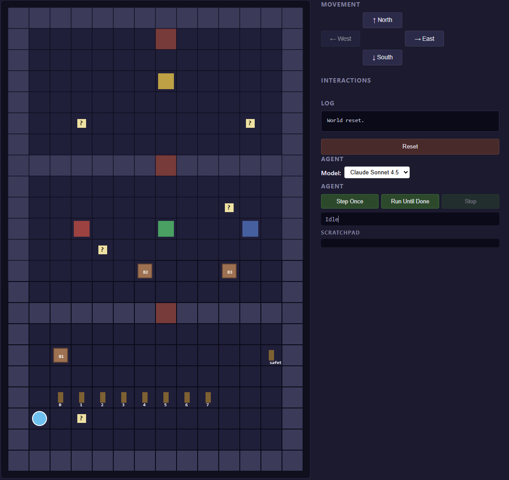

# LLM Agent Harness — 2D Escape Room

A scaffolded environment for testing LLM agents on a multi-room escape puzzle. The agent perceives a 2D grid through text observations, reasons about which puzzle to solve next, and acts via tool calls.

The harness was designed to be small enough to read in a sitting, but rich enough to surface real LLM failure modes — and several were surfaced.

## Demo

Three short clips, one per model, showing the agent attempting the puzzle:

- [Claude Haiku 4.5](docs/Clips/Haiku_run.mp4)
- [Claude Sonnet 4.5](docs/Clips/Sonnet_run.mp4)
- Claude Opus 4.7 _(recording pending — see [text log](logs/Opus_demo_runs/))_

Each clip is sped up roughly 8× for watchability. The full text logs of each run are in [`logs/`](logs/).

## Quick start

You will need Python 3.10+ and an Anthropic API key.

```bash
# 1. Clone
git clone https://github.com/Mushtaq-Ahmad1/llm-agent-harness-2d-world.git
cd llm-agent-harness-2d-world

# 2. Install
pip install -r requirements.txt

# 3. Add your API key
#    Create a file called .env in the project root containing:
#    ANTHROPIC_API_KEY=sk-ant-...
#    The .env file is gitignored and will not be committed.

# 4a. Run headless (saves agent run to a log file)
python run_agent.py claude-sonnet-4-5 > logs/my_run.txt 2>&1

# 4b. Or run the browser UI (watch the agent live)
python server.py
# then open http://127.0.0.1:5000
```

The browser UI exposes a dropdown to switch between Claude Haiku 4.5, Sonnet 4.5, and Opus 4.7 without editing code. Pressing "Run Until Done" steps the agent forward until it solves the puzzle or hits the 100-step cap.

The browser UI also supports manual play — you can use the arrow buttons to step through the puzzle yourself, which is the fastest way to understand the world before watching the agent attempt it.

Costs are approximate, based on current Anthropic API pricing as of May 2026:

| Model      | Cost per 100-turn run |
|------------|-----------------------|
| Haiku 4.5  | ~£0.40                |
| Sonnet 4.5 | ~£1.50                |
| Opus 4.7   | ~£2.20                |

## The world

The agent starts in the south-west corner of a 14×22 grid divided into three rooms, separated by locked doors. The goal is simple: reach the `EXIT` tile in the north room.



Each door is gated by a puzzle, and clues are distributed across the rooms on readable notes:

- **Room 1** — eight binary levers along the south wall. The agent must set them to encode the value 170 (10101010 in binary) to unlock door_1. The relevant note is in the same room.
- **Room 2** — three colored pressure plates (red, green, blue) and three labelled boxes (A, B, C). The mapping between labels and colors lives on a note in this room. Placing each box on its matching plate unlocks door_2.
- **Room 3** — a yellow pressure plate gates the exit door. Any box placed on the yellow plate opens the exit, but moving a box off a colored plate re-locks door_2 — unless a hidden safety lever in Room 1 has been activated first. Discovering this requires reading a note in Room 3 that points back to a mechanism in Room 1.

The third puzzle is what makes this interesting. It forces the agent to *un-do* its earlier solution, in a way that requires a cross-room journey and a non-obvious read of a specific note. Each of the three models I tested failed at a different point in this puzzle — see below.

## The harness

The agent perceives the world through a text observation built fresh each turn, and acts via tool calls (not text parsing).

**Action space.** Eight tools: `move(direction)`, `move_path(directions)`, `flip(lever_id)`, `read(note_id)`, `pick_up(box_id)`, `drop(box_id)`, `inspect(box_id)`, and `remember(text)`. Each turn the agent must call exactly one. The Anthropic SDK's tool-use interface handles parsing and validation, so the harness never has to wrangle freeform text into actions.

**Observation format.** The agent receives roughly 5,000 tokens per turn, structured into labelled sections:

- *Position and current room.* Coordinates plus a human-readable room name ("Room 1, the start room with the binary levers").
- *Local view.* A 7×7 ASCII window centered on the agent — close enough to plan moves, narrow enough to force exploration.
- *Visible objects within 5 cells.* Each tagged with interaction hints: `[walk to (6,12) first]` for objects out of reach, `[CORRECT — do not touch]` for boxes correctly placed on plates, `[BLOCKED]` for objects on the other side of a wall or locked door.
- *Puzzle progress.* Ground-truth state of every puzzle: which levers are flipped, which plates have which boxes, which doors are open.
- *Scratchpad.* Everything the agent has chosen to write down via `remember`.
- *Recent events.* The last 10 actions and their outcomes, with automatic warnings when the agent appears to be repeating itself.
- *Available actions.* The tools the agent can legally call from its current position.

**Memory.** There is no message history. The agent's only persistent state between turns is the scratchpad (controlled by the `remember` tool) and the sliding 10-event recent-events window. This keeps the prompt cost flat regardless of run length, but forces the agent to actively decide what to remember — and several of the interesting failure modes I found came from the agent not writing down something it would need later.

**Loop detection.** The harness watches for three failure patterns and injects warnings into the observation when they fire: exact action repeated 3+ times in 4 turns, eight consecutive movement actions without interaction, and the same object touched 4+ times in 6 turns. These nudges helped, but didn't eliminate, the looping behaviours described in the next section.

## How the three models performed

I ran the harness against three Claude models — Haiku 4.5, Sonnet 4.5, and Opus 4.7 — and watched each fail in a different way. The interesting finding wasn't that the bigger models got further (they did), but that *the kind of failure changed* as model capability increased. The three runs trace a rough arc from perception, to reasoning, to execution. Each run shown here is one sample; LLM agents are non-deterministic, and the same model on the same prompt will not produce identical behaviour on different runs.

### Haiku 4.5 — perception failure

Haiku could read notes, use the `remember` tool, and pick up boxes. Given enough turns, it eventually solved the binary lever puzzle. But it never reliably navigated through door_1 into Room 2.

The failure mode was spatial: Haiku could *see* a target object (a box at row 12) and *describe* a plan to reach it, but couldn't actually construct the multi-step path around walls and through the open doorway. The agent thrashed between positions near the door, trying to interact with objects whose adjacency tags told it "walk to (6,12) first" — but never managing the small detour east-then-north that the door required.

I made several harness improvements in response, including adding explicit door-direction hints in the observation. They helped, but didn't close the gap. The lesson: at this model size, the harness can only do so much. Spatial planning around obstacles is a model-capability problem, not an observation problem.

### Sonnet 4.5 — reasoning failure

Sonnet was qualitatively different. It read all the available notes, wrote multi-line plans to the scratchpad, and reliably solved Levels 1 and 2 — binary levers, then placing the correctly-labelled boxes on the colored pressure plates. Door_2 opened on schedule.

Then it stalled at Level 3. The puzzle requires the agent to:

1. Read `note_yellow` in Room 3, which says "place any box on the yellow plate to open the exit, but moving a placed box re-locks door_2 — look for another note in this room about how to safely move boxes."
2. Find `note_safety`, which reveals there's a safety lever in Room 1 that, once activated, freezes door_2 open.
3. Travel back to Room 1, flip the safety lever, return to Room 3, move a box to the yellow plate.

Sonnet found `note_yellow` and took the "look for another note" hint at face value. But `note_safety` and `note_plates` are *both* visible in Room 3, and Sonnet picked `note_plates` as the relevant one. It then looped trying to navigate to `note_plates`, hitting walls and giving up. The correct note was sitting three cells away, never read.

The failure here isn't perception (Sonnet sees fine) or execution (Sonnet navigates fine). It's *interpretation*: choosing the wrong clue and committing to it.

### Opus 4.7 — execution failure

Opus solved Levels 1 and 2 in 30 turns — the cleanest first half of any run. It correctly identified `note_safety` as the relevant note. It read the note, understood what the safety lever does, and wrote a clear plan to the scratchpad: "flip the safety lever in Room 1 to freeze door_2 open, then move a box to the yellow plate."

Then it failed to execute the plan.

The journey from Room 3 back to Room 1 is about 25 individual moves, with several walls and boxes to route around. Each time Opus tried to walk south through the room, the first navigation failure — a wall block or a box in the way — caused it to abandon the trip and re-evaluate. It would re-read `note_safety` to re-derive the plan, then try again, then bounce off the first obstacle, then re-read again. By turn 100 the agent had stated the correct plan repeatedly but never actually flipped the safety lever.

This is the most interesting failure mode of the three. Opus had the right perception, the right reasoning, and even the right written plan — but couldn't sustain commitment to a long action sequence through intermediate friction. It kept rerouting toward locally easier subgoals.

### The arc

Stacked together, the three runs describe a progression in failure sophistication:

| Model       | Failure mode | What it couldn't do |
|-------------|--------------|---------------------|
| Haiku 4.5   | Perception   | Construct paths around obstacles |
| Sonnet 4.5  | Reasoning    | Pick the right clue when multiple were plausible |
| Opus 4.7    | Execution    | Persist with a long plan through navigation friction |

Each subsequent model fails *later* in the cognitive pipeline. That's an encouraging trend, but it also suggests that simply scaling up the model wouldn't solve the puzzle either — the Opus failure suggests a different class of capability (plan persistence under friction) that scale alone may not fix.

## What I built and learned

I built the harness in five rough iterations over a week. Each version exposed a different failure mode that the next version was designed to address. The progression turned out to be more interesting than the final result.

**v1 — naive harness.** The first version gave the agent a structured observation, a small ASCII view, and the eight tool calls. No scratchpad, no recent events, no memory between turns. Haiku immediately fell into a "groundhog day" loop — every turn it would re-read the same note, re-derive the same plan, and forget by the next turn. The lesson was obvious in retrospect: an agent with no memory will solve nothing that takes more than one turn to plan.

**v2 — scratchpad and repetition warnings.** I added a `remember` tool that writes to a persistent scratchpad, and a 10-event recent-actions window. I also added an explicit warning in the observation when the agent repeated the same action three times. This unstuck the basic loops, but revealed a new failure: the agent was writing things to the scratchpad, then ignoring them. Sonnet would solve the binary lever puzzle, write the binary code down, then re-read the lever note three turns later anyway.

**v3 — spatial reasoning fixes.** Watching runs in the browser revealed that the agent struggled with reachability. It would try to interact with objects on the other side of walls or locked doors, and look confused when the action failed. I added a BFS-based reachability check that tags unreachable objects as `[BLOCKED]`, an explicit adjacency check that tags interactable-from-here vs walk-here-first, and a `BOXES IN VIEW` section that filters out boxes already correctly placed on their plates. This was the largest single improvement — Sonnet went from failing at Level 1 to reliably reaching Level 2.

**v4 — navigation hints.** Even with v3, both Haiku and Sonnet would sometimes stand one cell off-axis from an open door and conclude they were stuck. The wall message gave no hint about the door one cell to the east. I added room labels, door destination labels ("door_1: Room 1 → Room 2"), and direction hints on open doors ("walk 1 east then 4 north to reach it"). I also extended the wall-block error message to mention nearby doors. This closed most of the navigation failures for Sonnet, but Haiku still couldn't reliably construct paths around obstacles.

**v5 — plan persistence.** The Opus run revealed a different kind of failure. Opus solved Levels 1 and 2 cleanly, found the right clue for Level 3, articulated the solution — and then never wrote it to the scratchpad. By turn 60 it had forgotten the plan and was re-deriving it from scratch every five turns. I added a rule to the system prompt: *after reading any note that reveals a new action you need to take, your very next action must be `remember(...)` recording the action — plans are facts too.* In the next Opus run, the agent did exactly that — wrote the plan down — but still failed, this time because it couldn't sustain commitment to a 25-step journey through navigation friction. The fix solved the problem it was designed to solve, and revealed the next, harder problem.

The pattern across versions was consistent: each fix exposed a deeper failure. By v5 the harness was good enough that the remaining failures were genuinely interesting capability limits, not harness bugs.

## Limitations and next steps

The most visible limitation is that no model fully solved the puzzle
within 100 turns. The Opus failure — knowing the plan but not executing
it — points to a genuine open problem in agent design: persistence on
long-horizon plans when execution encounters friction.

A few directions I'd explore with more time:

- **Hierarchical planning.** Rather than re-deriving the whole plan every
turn, the agent could maintain an explicit goal stack: "currently working towards: flip safety lever in Room 1." Sub-failures (a wall block) would update the navigation step, not abandon the top-level goal.
- **Plan commitment surfaces.** When the agent has stated a plan in the scratchpad, the observation could highlight progress against it — "you stated: flip lever_safety; you are currently 18 cells from it." This would surface drift to the agent sooner.
- **Harder puzzles.** The current world has a small action space and a single solution path. Branching plots, time pressure, or adversarial elements would test the harness more thoroughly.
- **Multi-agent.** A "planner" agent that decides what to do next and an "executor" agent that handles navigation, communicating through a shared scratchpad. The Opus run suggests these capabilities are dissociable in current models.

Smaller polish items: the loop detector misses some near-duplicate patterns (slight variations in path arguments don't count as repeats), and the observation could be more compact — at 5,000 tokens per turn it's larger than it needs to be. 

## Project structure

```
llm-agent-harness-2d-world/
├── server.py              # Flask backend + browser live-agent endpoints
├── run_agent.py           # Headless agent runner (configurable model via CLI)
├── requirements.txt       # anthropic, python-dotenv, flask
├── src/
│   ├── world.py           # Grid, terrain enum, Lever/Note/Box dataclasses, World class
│   ├── levels.py          # build_world() — 14×22 three-room map
│   ├── observation.py     # build_observation() — text observation for the LLM
│   ├── serialize.py       # world_to_dict, action listings, legal_actions
│   └── agent.py           # Agent class, SYSTEM_PROMPT, tool schemas
├── templates/index.html   # Browser GUI
├── static/
│   ├── app.js             # Canvas renderer, agent live-view controls
│   └── style.css
├── logs/                  # Full text logs of every agent run
│   ├── Haiku_demo_runs/
│   ├── Sonnet_demo_runs/
│   └── Opus_demo_runs/
└── docs/
    ├── Clips/             # Sped-up demo recordings
    └── screenshots/       # World screenshots
```

The harness logic is roughly: `server.py` and `run_agent.py` are entry points → both use `src/agent.py` to drive the agent loop → which calls `src/observation.py` to build the prompt → which reads from a `World` defined in `src/world.py` → constructed by `src/levels.py`. The Flask routes in `server.py` are a thin wrapper around the same agent code used by `run_agent.py`, so the browser view and the headless logs come from identical agent behaviour.